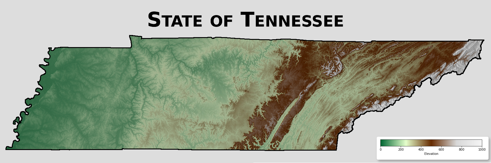

## Quick Links

:::::{grid} 1 1 3 3
::::{card}
:link: pages/resources.md
Education
^^^
Workshops, videos, StoryMaps, and geospatial learning materials.
::::

::::{card}
:link: pages/data.md
Data
^^^
Geospatial data resources for Tennessee, the U.S., and global use.
::::

::::{card}
:link: https://tnview.org
Web App
^^^
Explore TNView web applications and interactive geospatial tools.
::::
:::::

## Interested?

If you are interested in becoming a TNView partner, please contact us.

[Contact](pages/contact.md)