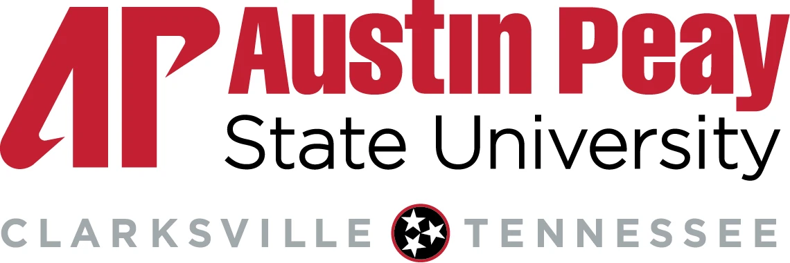
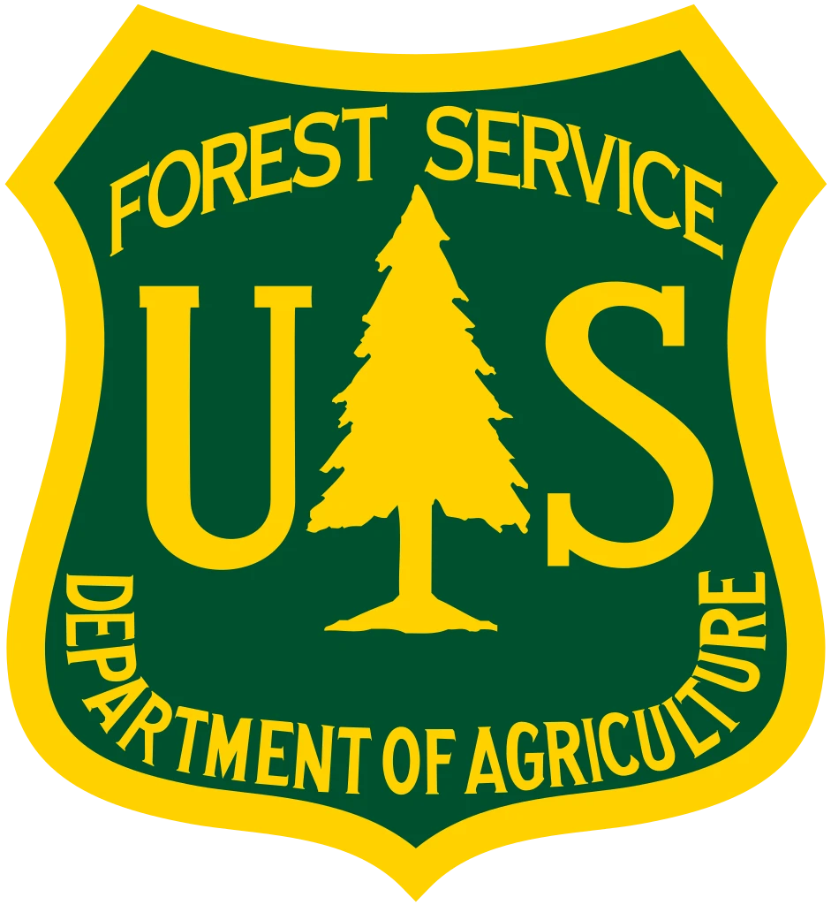
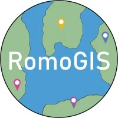
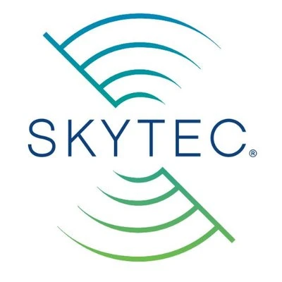

# Partners

## TNView Consortium Member Institutions and Organizations

The TennesseeView Consortium has **31** individuals from **15** entities across the state of Tennessee, including nine academic institutions, four state and federal government entities, and one private company.

If you are interested in becoming a TennesseeView partner, please [contact us](https://tnview.org/pages/contact/).

## Lead Institution

::::{grid} 1 1 2 2

:::{card}
:header: University of Tennessee, Knoxville

:::

:::{card}
:header: Members

- [Qiusheng Wu](https://geography.utk.edu/people/instructional-faculty/wu-qiusheng) (PI)
- [Michael Camponovo](https://geography.utk.edu/people/instructional-faculty/camponovo-michael) (Co-PI)
- [Hannah Herrero](https://geography.utk.edu/people/instructional-faculty/herrero-hannah)
- [Yingkui Li](https://geography.utk.edu/people/instructional-faculty/li-yingkui)
- [Liem Tran](https://geography.utk.edu/people/instructional-faculty/tran-liem) 
- [Emine Fidan](https://utia.tennessee.edu/person/?id=11763) 
- [Anna Marshall](https://geography.utk.edu/people/instructional-faculty/marshall-anna) 

:::

::::

## Other Academic Institutions

::::{grid} 1 2 3 3

:::{card}
:header: University of Tennessee, Chattanooga

- [Charlie Mix](https://www.utc.edu/interdisciplinary-geospatial-technology-lab)
- [Azad Hossain](https://www.utc.edu/directory/hrr794-biology-geology-and-environmental-science-azad-hossain/hrr794)
:::

:::{card}
:header: University of Memphis

- [Youngsang Kwon](https://www.ykwon23.com)
:::

:::{card}
:header: Austin Peay State University

- [Michael Wilson](https://www.apsugis.org)
:::

:::{card}
:header: East Tennessee State University

- [Andrew Joyner](http://www.tandrewjoyner.com)
- [Eileen Ernenwein](https://www.etsu.edu/cas/geosciences/facultystaff/ernenwei.php)
:::

:::{card}
:header: Middle Tennessee State University

- [Henrique Momm](https://www.mtsu.edu/faculty/henrique-momm)
- [Jeremy Aber](https://www.king-dead.net)
:::

:::{card}
:header: Tennessee State University

- [Clement Akumu](https://www.tnstate.edu/agriculture/resumes/clement_akumu.aspx)
- [David Padgett](https://www.linkedin.com/in/david-padgett-a14b8a8/)
- [Reginald Archer](https://www.tnstate.edu/agriculture/resumes/reginald_archer.aspx)
- [Bharat Pokharel](https://www.tnstate.edu/agriculture/resumes/Bharat_Pokharel.aspx)
:::

:::{card}
:header: Tennessee Tech University

- [Joseph Asante](https://www.tntech.edu/directory/cas/earthsciences/joseph-asante.php)
- [Samantha Allen](https://www.linkedin.com/in/samantha-allen-20317985/)
:::

:::{card}
:header: Vanderbilt University

- [Natalie Robbins](https://www.vanderbilt.edu/viigr/)
- [Steven Wernke](https://wernkelab.org/?page_id=114)
- [Stacy Curry-Johnson](https://researchguides.library.vanderbilt.edu/prf.php?account_id=181568)
:::

::::

## Government Agencies

::::{grid} 1 2 3 3

:::{card}
:header: Oak Ridge National Laboratory

- [Robert Stewart](https://www.ornl.gov/staff-profile/robert-n-stewart)
:::

:::{card}
:header: TN Department of Finance and Administration

- [Paul Dudley](https://tnmap.tn.gov)
:::

:::{card}
:header: TN Department of Transportation (TDOT)

- [Jennifer Pramuk](https://www.linkedin.com/in/jpramuk/)
:::

:::{card}
:header: USDA Forest Service

- [Jane R. Foster](https://janefoster.weebly.com/)
- [Todd Schroeder](https://www.srs.fs.usda.gov/staff/1036)
:::

::::

## Private Sectors

::::{grid} 1 2 3 3

:::{card}
:header: RomoGIS

- [Frank Romo](https://www.romogis.com)
:::

:::{card}
:header: Skytec LLC

- [Andy Carroll](https://skytecllc.com)
:::

::::
